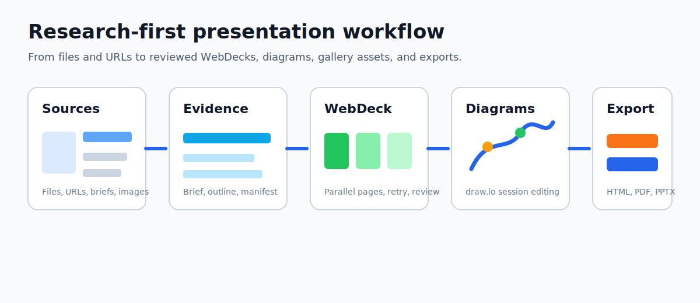

# PresentationAgent - 面向 AI 演示创作的智能工作区


[English](./README.md) | 简体中文

> 从一句 brief、一组文件或一个链接出发，生成可审阅、可编辑、可发布的演示工作流。
> PresentationAgent 把对话式创作、research-first 规划、WebDeck 页面编排、diagram-first draw.io 工作区、资产管理与公开画廊整合到同一个本地运行的平台里。

大多数 AI 演示工具会直接从 prompt 跳到 slides。PresentationAgent 面向研究型演示生产：先吸收资料，生成 evidence-first brief，再通过 WebDeck runtime 编排页面、支持重试和审稿，在 draw.io 中继续编辑图表，最后保存、发布或导出演示资产。



`Research-first` · `WebDeck Runtime` · `Diagram-first` · `Gallery & Remix` · `Packages & Skills`

## 为什么是 PresentationAgent

PresentationAgent 更像一个面向演示生产的智能工作区：

- **先研究，再生成**：附件、链接和上下文会先进入 briefing / evidence 阶段，再交给 planner 和页面编排。
- **不是单线程拼页面**：WebDeck runtime 按页面依赖并发生成，支持页级 lane 日志、失败页重试和整稿审稿。
- **流程图是一等公民**：Draw.io 采用 diagram-first 工作流，自动保存、校验、历史恢复都围绕 diagram session。
- **产物有生命周期**：文件上传、资产保存、公开画廊发布、Fork / Remix、package / skill 扩展都在同一个平台里完成。
- **本地可部署**：前后端运行在你的机器上，数据默认保存在本地 SQLite 与文件系统，外部调用只发生在你配置的模型和 API 上。

| 能力 | PresentationAgent | 模板填空工具 | 一次性 Chat 导出 |
|---|---|---|---|
| 基于资料的 research-first 规划 | ✅ | ⚠️ | ❌ |
| 页面级并发生成与重试 | ✅ | ❌ | ❌ |
| WebDeck 预览与继续编辑 | ✅ | ⚠️ | ❌ |
| Diagram-first draw.io 工作流 | ✅ | ❌ | ❌ |
| 资产 / 画廊 / Fork / Remix | ✅ | ❌ | ❌ |
| Package / Skill 扩展能力 | ✅ | ❌ | ❌ |

## 界面展示


## 成品展示
[人工智能发展现状与趋势分析.pptx](assets/%E4%BA%BA%E5%B7%A5%E6%99%BA%E8%83%BD%E5%8F%91%E5%B1%95%E7%8E%B0%E7%8A%B6%E4%B8%8E%E8%B6%8B%E5%8A%BF%E5%88%86%E6%9E%90.pptx)

## 示例项目

> **全新！** 跟随一个完整的端到端工作流，快速上手。

- **[创业公司 Pitch Deck](examples/startup-pitch/)** —— 基于一份公司简介，生成 10 页的 A 轮融资演示文稿。包含源材料、推荐 Prompt、逐步工作流说明和预期输出参考。

## 它有什么不同

- **不是一次性导出，而是工作区**：brief、页面、图表、资产和导出结果都可以继续调整。
- **Evidence-first 生成**：文档、链接和附件先进入规划上下文，再生成页面。
- **可观测的 WebDeck runtime**：页面依赖、lane 日志、失败重试、审稿和发布过程都能看到。
- **Diagram-first 编辑**：draw.io 是完整编辑流程的一部分，而不是只生成一张图。
- **默认本地优先**：SQLite 与本地文件系统让系统易于运行、调试和理解。

## 核心能力

- **对话式 WebDeck 创作**：从 brief、受众、页数和风格要求出发，先生成 structured brief / manifest，再进入正式页面生成。
- **Evidence-first 页面编排**：PDF、DOCX、PPTX、Markdown、图片、网址等资料会先被解析和整理为 evidence / context layers，减少“凭空写内容”的幻觉。
- **Dependency-aware 并发生成**：独立页面可以并发运行，当前调度器默认并发上限为 20；依赖页会按顺序调度，失败页和失败 lane 都可以定向重试。
- **强制审稿与可观测性**：支持页级和整稿级 review，生成过程可以看到 TOC、lane 状态、失败原因和重试结果，而不是只等一个最终文件。
- **WebDeck 编辑与版本回滚**：支持目录导航、当前页预览、页面保存、版本列表、回滚与整稿重新发布。
- **Diagram-first Draw.io 工作区**：支持图表创建、编辑、自动保存、结构校验、重试建议和会话恢复，AI 修改始终基于最新 diagram session。
- **多产物智能工作区**：同一工作区里可承载 `ppt`、`webdeck`、`drawio`、`document`、`code`、`webpage` 等 artifact。
- **资产、画廊与扩展生态**：生成结果可以保存为资产、发布到 gallery、被其他人 Fork / Remix，也可以通过 package registry 和 remote package import 引入新的 workflow。

## 典型工作流

1. 上传 PDF / DOCX / PPTX / Markdown / 图片等资料，或直接贴链接与文本。
2. 用自然语言说明目标受众、场景、页数、风格和重点结论。
3. 确认系统生成的 brief / outline / manifest。
4. 让 WebDeck runtime 并发生成页面，并对失败页或低质量页做 targeted retry。
5. 在 WebDeck 或 Draw.io 工作区继续人工微调。
6. 保存为资产，发布到画廊，或导出 HTML / PDF / PPTX 变体。

```text
你：请基于这份行业研究 PDF 和两张图表，做一份 10 页的 AI Agent 架构分享，
面向 CTO 和产品负责人，风格偏技术发布会。

AI：我会先整理资料要点和证据来源，生成 WebDeck brief 供你确认，
然后按页面并发产出草稿，最后给你可继续编辑的工作区与导出结果。
```

## 快速开始

### 1. 前置条件

| 依赖 | 是否必需 | 用途 |
|---|:---:|---|
| Python 3.12+ | ✅ | 后端运行时与 agent / tool 服务 |
| Node.js 18+ | ✅ | Next.js 前端 |
| npm 9+ | ✅ | 前端依赖安装 |
| `LLM_API_KEY` | ✅ | 连接你选择的模型服务 |
| Playwright Chromium | 推荐 | PDF 与 `pptx-faithful` 导出 |

> **TL;DR**：配置 `.env`、创建本地虚拟环境、`pip install -r requirements.txt`、安装前端依赖、启动前后端即可。

### 2. 克隆并配置项目

```bash
git clone https://github.com/GX-Alex/presentation-ppt-agent.git
cd presentation-ppt-agent
cp .env.example .env
```

编辑 `.env`，至少填入：

```bash
LLM_API_KEY=your-api-key
LLM_MODEL=deepseek/deepseek-chat
```

### 3. 创建虚拟环境并安装后端依赖

```bash
python3 -m venv .venv
source .venv/bin/activate
python -m pip install --upgrade pip
pip install -r requirements.txt
python -m playwright install chromium
```

> 如果你只想先跑通聊天、WebDeck、Draw.io 和 HTML 预览，可以暂时跳过 `python -m playwright install chromium`；但 PDF 与 `pptx-faithful` 导出会不可用。

<details>
<summary><strong>Windows PowerShell</strong></summary>

```powershell
py -3.12 -m venv .venv
.\.venv\Scripts\Activate.ps1
python -m pip install --upgrade pip
pip install -r requirements.txt
python -m playwright install chromium
```
</details>

### 4. 安装前端依赖

```bash
cd frontend
npm install
cd ..
```

### 5. 启动后端

```bash
source .venv/bin/activate
cd backend
python main.py
```

默认本地后端地址为 `http://localhost:8002`。

### 6. 启动前端

另开一个终端：

```bash
cd frontend
npm run dev
```

访问：

- Frontend: `http://localhost:3000`
- Backend Health: `http://localhost:8002/api/health`

如果你修改了后端端口，启动前端时显式设置 `BACKEND_URL`：

```bash
cd frontend
BACKEND_URL=http://localhost:8012 npm run dev
```

## 关键配置

| 环境变量 | 是否必需 | 默认值 | 说明 |
|---|:---:|---|---|
| `LLM_API_KEY` | ✅ | - | 主模型 API Key |
| `LLM_MODEL` | 否 | `deepseek/deepseek-chat` | 默认模型 |
| `DATABASE_URL` | 否 | 本地 SQLite | 数据库存储 |
| `CORS_ORIGINS` | 否 | `http://localhost:3000` | 允许访问的前端来源 |
| `PEXELS_API_KEY` | 否 | - | 图片检索增强 |
| `TAVILY_API_KEY` | 否 | - | Web research 增强 |

## 当前聚焦

> 当前主路径是 **WebDeck 生成 + Diagram-first 编辑 + 资产 / 画廊工作流**。
> 仓库中仍保留部分历史 PPT 路径与兼容接口，但项目正在持续收敛到统一的 web-native deck runtime。

## 技术栈

| 层级 | 选型 |
|---|---|
| 前端 | Next.js 15, React 19, TypeScript, Tailwind, Zustand |
| 后端 | FastAPI, SQLAlchemy asyncio, aiosqlite |
| 模型接入 | LiteLLM |
| 工作流 | WebSocket + REST, task-scoped agent loop, WebDeck runtime |
| 文档解析 | PyMuPDF, python-docx, python-pptx, openpyxl |
| 图表 / 图形 | Draw.io, SVG, HTML-based chart lanes |
| 导出 | HTML, PDF, PPTX faithful, PPTX editable |
| 持久化 | SQLite + 本地文件系统 |

## 项目结构

```text
presentation-ppt-agent/
├── backend/
│   ├── app/api/                  # files / gallery / packages / presentations / webdeck ...
│   ├── app/core/                 # agent loop, LLM client, tool dispatch
│   ├── app/tools/                # parse_document, edit_diagram, web_search, retry_failed_deck_pages ...
│   ├── app/services/
│   │   ├── webdeck_runtime/      # director, planner, scheduler, reviewer, publish
│   │   ├── browser_pool.py       # Playwright 导出能力
│   │   ├── export_service.py     # HTML / PDF / PPTX 导出
│   │   └── package_registry.py   # package / workflow 扩展
│   └── main.py
├── frontend/
│   ├── src/components/chat/      # 对话与状态反馈
│   ├── src/components/webdeck/   # WebDeck 预览与编辑
│   ├── src/components/drawio/    # Diagram workspace
│   ├── src/components/workspace/ # 多 artifact 工作区
│   └── src/components/packages/  # package registry UI
├── docs/plans/                   # 设计与演进方案
├── .env.example
├── requirements.txt              # 根目录后端依赖入口
├── README.md
└── README_CN.md
```

## 路线图

- 更强的 WebDeck hybrid editor 与页面级细粒度编辑体验
- 更成熟的公共画廊与团队协作机制
- 更稳健的导出适配与发布链路
- 更丰富的 package / skill 工作流分发能力
- 更完整的公开文档与示例项目

更多方向和 good-first-issue 可见 [docs/ROADMAP.md](docs/ROADMAP.md)。

## 增加项目曝光

- 按 [docs/PROMOTION.md](docs/PROMOTION.md) 中的建议添加 GitHub topics。
- 用 [assets/social-preview.svg](assets/social-preview.svg) 生成仓库 social preview。
- 按 [CHANGELOG.md](CHANGELOG.md) 发布第一个 release。
- 使用 [docs/PROMOTION.md](docs/PROMOTION.md) 中的中英文发布文案。
- 使用 `.github/ISSUE_TEMPLATE/` 中的模板收集 bug、功能建议和 good-first-issue。

## 反馈

欢迎用它来做真实的演示、研究汇报、架构分享和流程图协作场景。
如果它对你有帮助，公开发布后给一个 Star，并通过 Issue / PR 分享问题与改进建议。
