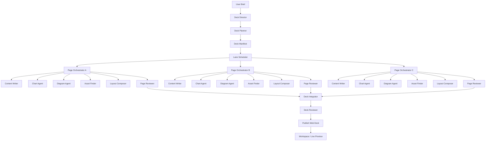

# 从 Native PPTX 转向 Web-Native Deck 的架构决策与实现规划

## 1. 决策摘要

在当前项目里继续强化 Native PPTX，不再是最优路径。

原因不是导出链路做不通，而是产品目标已经变化了：

- 你要的不是“可导出的 PPT 文件”，而是“每一页都是信息丰富、排版精美、可互动、可复用、可持续演进的 Web 页面”。
- 你要的不是“一个 agent 顺序生成整份 deck”，而是“页级 orchestrator + 多 subagent 分工 + 资产组合 + 可恢复运行时”。
- 你要的不是“文件生产”，而是“演示系统生产”。

所以，项目的核心方向应从：

- `Native PPTX-first`

切换为：

- `Web-Native Deck-first`
- `Page-as-App`
- `PPT as Code / Deck as Code`
- `Orchestrated Multi-Agent Presentation Runtime`

结论很明确：

1. 应该放弃原生 PPTX 作为主目标。
2. 应该保留当前系统中与研究、规划、审稿、资产解析、工作区展示有关的基础件。
3. 不应该继续把复杂能力堆进现有 `agent_loop`。
4. 应该新增一套独立的 `webdeck orchestration runtime`，把现有 `agent_loop` 降级为通用对话入口。


## 2. 外部参考研究结论

### 2.1 小红书笔记 “PPT as Code：用网页高效做出比PPT还惊艳的 PPT as Code”

说明：该笔记正文受登录限制，无法完整抓取全文；以下结论基于页面可见标题、摘要文案和页面结构信息提炼，属于方向性研究，而不是逐字复现。

从可见内容看，这篇文章的核心不是“把 PPT 换个渲染器”，而是把演示思维彻底改写：

- 演示稿不再是一次性二进制文件，而是可复用、可迭代、可分享的 Web 资产。
- 一页演示不只是静态排版，而是可以拥有：分页、滑动、状态切换、进度条、URL 同步、交互反馈。
- 演示制作不再是“手工拖拽版式”，而是“组件化 + 容器化 + 页面状态驱动”。
- Web 技术天然更适合承载复杂图表、动画、代码演示、嵌入式图形、响应式布局。

这篇文章对本项目最重要的启发有 4 点：

1. 演示稿应该被视为 `应用`，不是 `文件`。
2. 页面应该是 `组件组合结果`，不是 `文本转版式` 的单步产物。
3. 整体风格应该由全局设计 token 和布局系统控制，而不是每页各写各的 HTML。
4. URL、状态、页面结构、目录、进度这些信息都应该成为一等公民。


### 2.2 `claw-code` / OmX / OmO / clawhip 设计启发

从可抓取的 README、PHILOSOPHY、USAGE 中，最关键的不是某个具体 CLI 命令，而是它强调的系统观：

- 真正的产品不是生成出来的文件，而是产生这些文件的协调系统。
- 多个 agent 应该并行协作，而不是共挤在同一个上下文窗口里串行工作。
- 事件监控、通知路由、状态汇报不应该占据 agent 的上下文；这些应由外部协调层承担。
- 计划、执行、复审、重试应该是显式循环，而不是靠单次 prompt 暗示。
- 机器可读的 lane state 很重要，因为它决定了系统是否能恢复、重跑、审计、并行化。

对应到你的目标，`claw-code` 提供的不是“页面怎么画”，而是“复杂工作如何拆成多个可恢复的执行 lane”。

它给本项目的直接启发是：

1. 不要继续把“目录规划、单页编排、图表生成、架构图生成、审稿、合成”塞进一个对话循环。
2. 应该把通知、进度、失败恢复、子任务依赖从 LLM prompt 中剥离出来。
3. 应该为每一页、每一个子资产建立独立状态机。
4. 应该允许不同角色 agent 并行推进，再由上层 orchestrator 做收敛。


## 3. 当前项目的可复用基础与主要阻塞

### 3.1 可以保留的基础

当前 `generalagent` 并不是一无所有，以下能力非常有价值，应该迁移复用：

1. 结构化 Brief 入口。
	 当前已有质量生成表单和结构化 brief 模型，适合作为未来 Web deck 的立项入口。

2. 报告优先 / 研究优先流程。
	 当前 `report_then_ppt` 思路是对的，未来应该升级为 `research -> deck plan -> page generation`。

3. 附件解析和 URL 抓取。
	 `parse_document` 和 `fetch_url` 已经能把外部材料变成可消费内容，这是所有后续页面生成的底座。

4. Reviewer / 大纲确认思想。
	 当前质量流程已经引入 outline review 和确认点，这种“先规划、再执行”的产品观必须保留。

5. 包运行时与执行日志。
	 `package_runtime`、`plugin_registry`、`ExecutionLog`、`WorkflowBinding` 这些基础设施非常适合改造成 orchestration runtime 的执行审计层。

6. Web artifact 展示能力。
	 当前已经能渲染 `webpage` artifact，这意味着浏览器端预览路径已经存在，只是还太薄。

7. Task checkpoint / rollback 机制。
	 当前 checkpoint 更偏向单任务快照恢复，但它证明系统已经有“恢复”意识，这个方向是正确的。


### 3.2 当前阻塞点

如果不重构，这些地方会直接卡死你的新目标：

1. 当前 `agent_loop` 是单循环串行模型。
	 核心结构仍是：

	 - 组装上下文
	 - 调 LLM
	 - 如需工具则依次执行
	 - 再回到 LLM

	 这适合通用聊天和轻量工具调用，不适合页级并行 orchestrator。

2. 当前工作区是单激活 artifact 模型。
	 前端 store 只有一个 `currentArtifactType` 和一份 `artifactContent`，这意味着：

	 - 当前页 Web 预览
	 - 文档底稿
	 - draw.io 图
	 - 图表数据
	 - 证据素材

	 这些东西不能同时作为一套 deck 的组成部分被管理，只能轮流看。

3. 当前 `webpage` artifact 只是整块 HTML。
	 它更像临时沙盒，而不是一个可分页、可路由、可组合、可局部更新的演示工程。

4. 当前页面生成仍是“单页 HTML 结果”，不是“页面资产图谱”。
	 未来需要的是：

	 - 页面规格 `PageSpec`
	 - 页面子任务 `PageTask`
	 - 页面资产 `AssetNode`
	 - 页面评审结果 `ReviewReport`
	 - 页面产物 `PageBundle`

	 当前系统没有这层模型。

5. 当前 checkpoint 是对单任务对话快照，不是 lane-runtime checkpoint。
	 它能回滚消息和演示快照，但不能表达：

	 - 第 4 页图表任务已完成
	 - 第 7 页架构图失败需重试
	 - 全局主题 agent 已产出 token
	 - 目录已锁定但某页仍在审稿


## 4. 回答核心问题：`agent_loop` 要不要重构

要重构，但方式不能是“把现有 `agent_loop` 继续做大”。

### 4.1 错误路线

错误路线是：

- 在现有 `agent_loop` 里加更多 if/else
- 让 LLM 自己负责页级任务拆分、子任务调度、失败恢复、结果聚合
- 把所有状态都继续藏在 prompt 和消息历史里

这样做的结果一定是：

- prompt 爆炸
- 状态不可恢复
- 并行性很差
- debug 成本极高
- 页面之间风格不稳定


### 4.2 正确路线

正确路线是把现有系统拆成两层：

#### A. 通用对话层

保留当前 `agent_loop`，职责缩小为：

- 通用聊天
- 轻量问答
- 普通 artifact 生成
- 触发特定 workflow runtime

它不再直接负责复杂 deck 生产。

#### B. Web Deck Orchestration Runtime

新增独立运行时，负责：

- deck 级规划
- 页面级任务编排
- 子资产级任务编排
- 多 lane 执行
- 评审与回退
- 实时状态推送
- 最终发布与预览


### 4.3 结论

因此，答案不是“继续优化当前 `agent_loop`”，而是：

- `保留当前 agent_loop 作为 chat runtime`
- `新建 webdeck runtime 作为 orchestration runtime`

这是一种“旁路重构”，不是“在原地缝补”。


## 5. 目标架构：Hardness Web-Native Deck Runtime

### 5.1 设计目标

所谓 `hardness`，在这个项目里的具体含义不是“更复杂”，而是：

- 任务结构显式
- 状态机显式
- 可并行
- 可恢复
- 可审计
- 可复跑
- 可评估
- 可逐层收敛


### 5.2 目标运行时分层




### 5.3 关键角色

#### 1. Deck Director

负责整份演示的总控：

- 接收 brief
- 生成或确认研究策略
- 设定全局目标
- 决定页面数、目录结构、叙事主线
- 将 deck 任务拆成 page 任务


#### 2. Deck Planner

产出机器可读的 `DeckManifest`：

- 全局标题、副标题、目录
- 页面顺序
- 每页目标
- 每页需要的资产类型
- 页面间依赖
- 全局设计 token


#### 3. Page Orchestrator

每一页一个 orchestrator，职责是：

- 读取 `PageSpec`
- 判断该页要不要图表 / 架构图 / 截图 / 表格 / 引文 / 代码 demo
- 继续把任务拆给下游 subagents
- 收集产物
- 组合成最终页面 HTML/组件树
- 发起页级 review


#### 4. Specialized Subagents

至少分成这些角色：

- `Narrative Agent`: 负责本页叙述和文案
- `Data Agent`: 负责结构化数据和图表配置
- `Diagram Agent`: 负责 draw.io / SVG / 架构图
- `Asset Agent`: 负责图片、图标、参考资产
- `Layout Agent`: 负责版式组合和视觉层级
- `Reviewer Agent`: 负责页级质检


#### 5. Deck Integrator

把每一页的结果组合成整套 Web deck：

- 路由
- 目录
- 主题
- 页面切换
- 进度条
- URL state
- 全局资源注入


#### 6. Deck Reviewer

对整份 deck 做跨页审查：

- 是否重复
- 节奏是否合理
- 风格是否一致
- 目录与页面是否一致
- 关键结论是否贯穿


## 6. 新的数据契约

### 6.1 `DeckManifest`

建议把 deck 规划结果标准化成：

```json
{
	"deck_id": "deck_xxx",
	"title": "AI 客服改造方案",
	"subtitle": "从现状诊断到实施路线",
	"global_theme": {
		"brand_mode": "executive_clean",
		"palette": "slate_cyan",
		"motion": "subtle",
		"density": "medium"
	},
	"toc": [
		"执行摘要",
		"现状诊断",
		"目标架构",
		"价值测算",
		"实施路线"
	],
	"pages": [
		{
			"page_id": "p01",
			"title": "执行摘要",
			"role": "summary",
			"goal": "让管理层在 30 秒内理解方案价值",
			"required_assets": ["metric_cards", "callout"],
			"dependencies": []
		}
	]
}
```


### 6.2 `PageSpec`

每页应该是显式规格，而不是松散 HTML：

```json
{
	"page_id": "p04",
	"title": "目标架构",
	"page_kind": "architecture_explainer",
	"objective": "展示目标系统结构和关键控制点",
	"narrative_contract": {
		"core_message": "架构简化了接入层并强化了治理层",
		"audience": "管理层",
		"tone": "firm"
	},
	"asset_requirements": [
		{"type": "diagram", "kind": "architecture"},
		{"type": "chart", "kind": "before_after"}
	],
	"evidence_refs": ["attachment-1", "web-2"],
	"review_rules": [
		"must_have_visual_center",
		"must_be_executive_readable",
		"must_not_exceed_45_words_primary_text"
	]
}
```


### 6.3 `PageBundle`

每页最终应该产出一组可组合资产：

```json
{
	"page_id": "p04",
	"status": "reviewed",
	"html": "<section data-page-id=...>...</section>",
	"css_tokens": {"accent": "#45d0ff"},
	"js_modules": [],
	"artifacts": [
		{"kind": "svg", "asset_id": "asset_diagram_1"},
		{"kind": "chart_config", "asset_id": "asset_chart_1"}
	],
	"review": {
		"score": 0.88,
		"issues": []
	}
}
```


## 7. 页面级多 Subagent 编排方式

### 7.1 页级编排样例

例如一页需要：

- 架构图
- 图表
- 页面叙述
- 最终版式整合

正确流程应该是：

1. `Page Orchestrator` 读取 `PageSpec`
2. 生成 4 个 lane：
	 - `diagram_lane`
	 - `chart_lane`
	 - `narrative_lane`
	 - `asset_lane`
3. 各 lane 并行执行
4. 结果回收后交给 `layout_lane`
5. `layout_lane` 生成最终页面结构
6. `review_lane` 做页级审稿
7. 如不通过，则只重跑失败子模块，不重做整页


### 7.2 为什么一定要这么拆

因为如果让一个 agent 一次性完成：

- 内容写作
- 图表数据映射
- draw.io 图形生成
- HTML 编排
- 样式统一

它几乎必然出现：

- 某一子模块出错时整页重做
- 页面风格漂移
- 图表和文本相互脱节
- 调试困难


## 8. 当前前后端需要如何重构

### 8.1 后端重构建议

不要继续让复杂 deck 生成直接走 `agent_loop.py`。

建议新增：

```text
backend/app/services/webdeck_runtime/
	director.py
	planner.py
	scheduler.py
	lane_runner.py
	page_orchestrator.py
	artifact_composer.py
	reviewer.py
	state_store.py
	contracts.py
```

并新增新的入口：

- `ws/chat` 继续保留通用对话
- 新增 `ws/webdeck` 或在 `ws/chat` 中引入新的 message type：
	- `webdeck_generate`
	- `webdeck_retry_page`
	- `webdeck_retry_lane`
	- `webdeck_approve_plan`
	- `webdeck_patch_page`


### 8.2 数据模型重构建议

当前 `Task / Presentation / Slide` 模型不够表达页级 orchestrator。

建议新增或替代：

- `DeckProject`
- `DeckVersion`
- `DeckPage`
- `PageTask`
- `LaneRun`
- `AssetNode`
- `ReviewReport`
- `DeckPublish`

其中最关键的是：

- `DeckPage`: 存页面规格和最终 bundle
- `LaneRun`: 存每个子任务的执行状态
- `AssetNode`: 存图表 / SVG / 图片 / 文本块等资产节点


### 8.3 前端重构建议

当前工作区是“单 artifact viewer”，未来应该变成“演示工程工作台”。

目标 UI 结构建议为：

- 左侧：目录 / 页面树 / 进度状态
- 中间：当前页 live preview
- 右侧：页面资产 inspector
- 底部：lane log / review / retry 面板

也就是说，当前这些组件都需要升级：

- `WebSandboxViewer` 不再只是整页 iframe，而是 deck app 容器
- `WorkspacePanel` 不再只按 artifact type 切换，而是按 `project + page + assets` 组织
- `chatStore` 不再只存一份 artifact，而是存整套 deck runtime 状态


## 9. 从当前项目迁移到新架构的最优路线

### 阶段 0：战略切换

完成事项：

- 冻结 Native PPTX 主线
- 所有“零到一 PPT”入口改名为 `Web Deck`
- 把 `webpage` 升级为主展示载体


### 阶段 1：Web Deck MVP

目标：先做出可用的 Web-native 演示系统，不立即追求多 lane 并行。

做法：

- 先保留现有 quality brief
- 先生成 deck manifest
- 每页先用单 agent 产出 HTML 页面
- 整体用统一 layout shell 组装

交付标准：

- 整份 deck 可分页浏览
- 有目录、页码、URL 同步、全局主题
- 每页是独立 Web 页面而不是 reveal.js section 列表


### 阶段 2：页级多资产

目标：让单页不再只是 HTML 文本，而是多资产组合。

做法：

- 引入 `PageSpec`
- 引入 `diagram/chart/asset` 子任务
- 页面 bundle 化

交付标准：

- 架构图页可以自动调 draw.io lane
- 数据页可以自动调 chart lane
- 布局层能将多资产组合成一个页面


### 阶段 3：Lane 并行 + 状态机

目标：真正走向 hardness。

做法：

- 引入 `LaneRun`
- 页面子任务可并行
- 支持失败重试和局部重跑

交付标准：

- 某个 chart lane 失败时不影响 narrative lane
- 某页失败只重跑该页，不重做整份 deck


### 阶段 4：Reviewer / Recover / Publish

目标：构建稳定的生产系统，而不是 demo。

做法：

- deck reviewer
- page reviewer
- 局部 patch
- 版本化发布
- checkpoint 到 lane 级

交付标准：

- 可追溯
- 可恢复
- 可迭代
- 可审计


## 10. 你现在最应该做的事

### 第一优先级：不要先改页面模板，先改运行时边界

如果先改视觉模板而不改运行时，最终一定还是单代理拼 HTML，只是外观看起来更花。

优先顺序应该是：

1. 定义 `DeckManifest / PageSpec / PageBundle / LaneRun` 数据契约
2. 新建 `webdeck_runtime`
3. 改前端 store，从单 artifact 切成 deck project 模型
4. 再做页面视觉系统和资产组合


### 第二优先级：不要让 `webpage artifact` 继续停留在“整块字符串 HTML”层

应该升级为：

- 页面组件树
- 页面 bundle
- deck shell
- 资产索引
- 发布产物


### 第三优先级：不要急着上“所有页都多 agent”

建议先把多 agent 只用在这些高价值页面：

- 执行摘要页
- 架构图页
- 核心图表页
- 路线图页

其余普通内容页可以先用单 page agent。


## 11. 我的明确建议

### 建议一：战略上彻底转向 Web-Native Deck

这是正确决定。


### 建议二：架构上不要“重写 agent_loop”，而要“新增 orchestration runtime”

这是本次重构里最重要的技术判断。


### 建议三：产品上把“deck”定义成项目，而不是 artifact

deck 需要有：

- 页面树
- 资产图谱
- 运行状态
- 审稿状态
- 发布版本


### 建议四：研发上先做 MVP，再走 hardness 完整形态

否则会因为目标过大而一直卡在架构讨论里。


## 12. 推荐的立即开工清单

如果现在开始实施，我建议第一批任务就是这 10 项：

1. 新建 `webdeck_runtime/contracts.py`，定义核心 JSON 契约。
2. 新建 `webdeck_runtime/director.py`，把 deck 生成从 `agent_loop` 中剥离。
3. 新建 `webdeck_runtime/page_orchestrator.py`，支持单页独立生成。
4. 新建 `webdeck_runtime/scheduler.py`，先支持串行页执行，后续再加并行 lane。
5. 新增数据库模型：`DeckProject / DeckPage / LaneRun / AssetNode`。
6. 前端重构 `chatStore`，改成 `deck project state`。
7. 升级 `WorkspacePanel`，支持“目录 + 预览 + 资产”三栏布局。
8. 升级 `WebSandboxViewer`，从单 HTML iframe 变成 deck shell viewer。
9. 实现第一版 `DeckManifest -> route-based web deck` 的发布器。
10. 只挑 4 类高价值页面接入 subagent：摘要、架构图、图表、路线图。


## 13. 最后结论

这个项目现在确实到了“可以不介意重构”的节点。

不是因为当前实现差，而是因为目标已经从：

- `高质量生成 PPT`

升级成：

- `让 AI 生产可组合、可恢复、可审稿、可发布的 Web 演示系统`

一旦目标变成后者，真正的核心就不再是导出格式，而是：

- orchestration runtime
- page-level decomposition
- asset graph
- lane state
- review / retry / recover
- deck shell

这就是应该朝着的 `hardness` 方向。